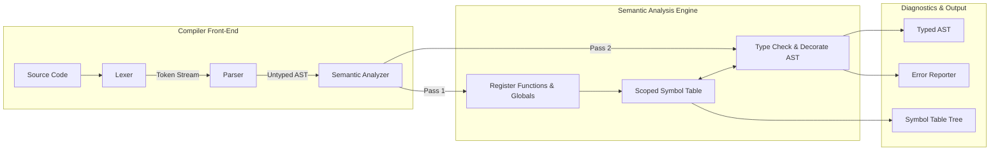

# Semantic Analyzer for an Imperative Language

[](https://en.cppreference.com/w/cpp/17)
[](LICENSE)
[]()
[]()

A robust, modular, and extensible **Semantic Analyzer** written in modern C++17 for a statically typed imperative programming language. It performs comprehensive declaration verification, lexical scope tracking, static type checking, type coercion/widening, and l-value validation.

---

## Table of Contents

- [Overview](#overview)
- [Key Features](#key-features)
- [Architecture Pipeline](#architecture-pipeline)
- [Language & Type System](#language--type-system)
- [Getting Started](#getting-started)
  - [Prerequisites](#prerequisites)
  - [Building from Source](#building-from-source)
- [CLI Usage](#cli-usage)
- [Example Walkthrough](#example-walkthrough)
- [Test Suite & Verification](#test-suite--verification)
- [Project Structure](#project-structure)
- [Documentation Index](#documentation-index)
- [Contributing](#contributing)
- [License](#license)

---

## Overview

The Semantic Analyzer acts as the core verification phase in the compiler front-end. It takes untyped Abstract Syntax Trees (ASTs) generated by the recursive-descent parser and enforces semantic constraints that cannot be checked during lexical or syntactic analysis alone.

The system uses a **two-pass architecture**:
1. **Pass 1 (Top-Level Declarations):** Collects and registers global variables and function signatures into the symbol table to allow forward references and mutual recursion without header prototypes.
2. **Pass 2 (AST Visitor Walk):** Performs in-depth scope resolution, type inference, operator type checking, l-value validation, and in-place type annotation of expression nodes to produce a **Typed AST**.

---

## Key Features

### 1. Declaration & Scope Checking
- **Undeclared Identifier Detection:** Detects variables, arrays, and functions used without prior declaration.
- **Duplicate Declaration Prevention:** Flags variable, parameter, or function re-declarations within the same lexical scope.
- **Hierarchical Symbol Table:** Scopes form an explicit tree (Global $\rightarrow$ Functions $\rightarrow$ Nested Blocks).
- **Lexical Scoping & Variable Shadowing:** Inner scope declarations correctly shadow outer identifiers of the same name.
- **Lifetime & Scope Exit Enforcement:** Identifiers declared within blocks are strictly inaccessible after block exit.
- **Void Type Enforcement:** Forbids declaring variables or parameters with `void` type.
- **Forward Reference Resolution:** Supports calling functions before their textual definitions.

### 2. Static Type Checking & Promotion
- **Primitive Types:** `int`, `float`, `bool`, `char`, `void`.
- **Derived Types:** Fixed-size 1D arrays (`T[N]`) and functions (`ReturnType(ParamTypes...)`).
- **Implicit Widening (Numeric Promotion):** Automatically widens `int` to `float` in assignments, arithmetic expressions, and function arguments.
- **Strict Control Flow Conditions:** Enforces that `if` and `while` condition expressions evaluate strictly to `bool`.
- **Return Type Conformance:** Verifies that function returns match their declared signatures (`void` functions cannot return values; non-`void` functions must return compatible types).
- **Cascading Error Suppression:** Employs a `<type-error>` sentinel type to prevent cascading error messages for nested expressions once a primary error is recorded.

### 3. L-Value & Subscript Validation
- Enforces that the Left-Hand Side (LHS) of an assignment is a valid, modifiable l-value.
- Disallows whole-array assignments (`arr1 = arr2;`) and function assignments (`func = 5;`).
- Validates array subscripting: ensures index expressions evaluate strictly to `int` and elements match the array's declared type.

---

## Architecture Pipeline



For full architectural details, see [docs/ARCHITECTURE.md](docs/ARCHITECTURE.md).

---

## Language & Type System

### Type Promotion & Compatibility Matrix

| Expression Type | Assigned to `int` | Assigned to `float` | Assigned to `bool` | Assigned to `char` |
|:---|:---:|:---:|:---:|:---:|
| **`int`** | Yes (Exact) | Yes (Widening) | No | No |
| **`float`** | No | Yes (Exact) | No | No |
| **`bool`** | No | No | Yes (Exact) | No |
| **`char`** | No | No | No | Yes (Exact) |

For the complete formal grammar in EBNF and type rules, refer to [docs/LANGUAGE_SPEC.md](docs/LANGUAGE_SPEC.md).

---

## Getting Started

### Prerequisites
- Modern C++ compiler with **C++17** support (`g++ >= 9.0` or `clang++ >= 9.0`).
- GNU `make`
- Linux / macOS / WSL environment

### Building from Source
Clone the repository and build the binary:
```bash
make clean
make
```
This produces the executable `./semantic_analyzer`.

---

## CLI Usage

```text
Usage: ./semantic_analyzer [options] <source-file>

Options:
  --dump-ast        Print the abstract syntax tree
  --dump-typed-ast  Print the AST annotated with inferred types
  --dump-symbols    Print the hierarchical symbol table
  --all             Dump AST, Typed AST, and Symbol Table
  -h, --help        Show this help message
```

If `<source-file>` is omitted, input is read from standard input (`stdin`).

---

## Example Walkthrough

Given a sample program `example.txt`:
```c
int globalCount = 0;
float pi = 3.14;

int main() {
    int a = 10;
    int b = 20;
    int c = a + b * 2;
    return c;
}
```

Run the analyzer with `--all`:
```bash
./semantic_analyzer --all example.txt
```

### Output: Typed AST
```text
=============================== TYPED AST ===============================
Program
  VarDecl(int globalCount)
    LiteralExpr(0 : int)
  VarDecl(float pi)
    LiteralExpr(3.14 : float)
  FunctionDecl(int main)
    Block {
      VarDecl(int a)
        LiteralExpr(10 : int)
      VarDecl(int b)
        LiteralExpr(20 : int)
      VarDecl(int c)
        BinaryExpr(+ : int)
          VariableExpr(a : int)
          BinaryExpr(* : int)
            VariableExpr(b : int)
            LiteralExpr(2 : int)
      ReturnStmt
        VariableExpr(c : int)
    }
=========================================================================
```

### Output: Hierarchical Symbol Table
```text
=========================== SYMBOL TABLE HIERARCHY ===========================
Scope ID: 0 | Name: "Global" | Level: 0
  +----------------------+--------------------+------------+-------+-------+
  | Symbol Name          | Type               | Kind       | Line  | Col   |
  +----------------------+--------------------+------------+-------+-------+
  | main                 | int()              | Function   |     4 |     5 |
  | pi                   | float              | Variable   |     2 |     7 |
  | globalCount          | int                | Variable   |     1 |     5 |
  +----------------------+--------------------+------------+-------+-------+

  Scope ID: 1 | Name: "Function main" | Level: 1
    +----------------------+--------------------+------------+-------+-------+
    | Symbol Name          | Type               | Kind       | Line  | Col   |
    +----------------------+--------------------+------------+-------+-------+
    | c                    | int                | Variable   |     7 |     9 |
    | b                    | int                | Variable   |     6 |     9 |
    | a                    | int                | Variable   |     5 |     9 |
    +----------------------+--------------------+------------+-------+-------+
==============================================================================

Semantic analysis passed successfully with 0 errors.
```

---

## Test Suite & Verification

The project includes an automated test runner validating both positive and negative cases:

```bash
make test
```
Or directly:
```bash
./run_tests.sh
```

### Test Summary

| Test File | Category | Target Verification | Expected Status |
|---|:---:|---|:---:|
| `test1_valid_basic.txt` | Positive | Primitive types, expressions, if/while, returns | **Pass (0 errors)** |
| `test2_valid_scopes.txt` | Positive | Nested block scopes and variable shadowing | **Pass (0 errors)** |
| `test3_valid_functions.txt` | Positive | Functions, arguments, arrays, and numeric widening | **Pass (0 errors)** |
| `test4_error_undeclared.txt` | Negative | Undeclared variables and functions | **Fail (3 errors)** |
| `test5_error_redeclared.txt` | Negative | Duplicate identifiers and parameter collisions | **Fail (4 errors)** |
| `test6_error_type_mismatch.txt` | Negative | Type mismatches and invalid operand types | **Fail (6 errors)** |
| `test7_error_condition.txt` | Negative | Non-boolean conditions in `if` and `while` | **Fail (2 errors)** |
| `test8_error_function_args.txt` | Negative | Argument count and type mismatches in function calls | **Fail (4 errors)** |
| `test9_error_return_mismatch.txt` | Negative | Void/non-void return violations | **Fail (4 errors)** |
| `test10_error_invalid_lvalue.txt` | Negative | Invalid l-values and subscript violations | **Fail (5 errors)** |

See [docs/TESTING.md](docs/TESTING.md) for full test details and instructions on adding new tests.

---

## Project Structure

```
.
├── Makefile                     # Build, clean, and test rules
├── README.md                    # Project overview and documentation
├── LICENSE                      # MIT Open Source License
├── CONTRIBUTING.md               # Contribution guidelines
├── .gitignore                   # Git ignore specifications
├── run_tests.sh                 # Test suite runner script
├── docs/                        # Detailed architectural and language documentation
│   ├── ARCHITECTURE.md          # Two-pass design, AST visitor, symbol table
│   ├── LANGUAGE_SPEC.md         # Formal grammar (EBNF), type rules, constraints
│   └── TESTING.md               # Test catalog and verification guide
├── src/                         # Compiler front-end C++ source code
│   ├── Token.hpp                # Token definitions & categories
│   ├── Lexer.hpp / .cpp         # Lexical scanner
│   ├── AST.hpp / .cpp           # Abstract syntax tree & Visitor interface
│   ├── Parser.hpp / .cpp        # Recursive-descent parser
│   ├── Type.hpp / .cpp          # Type representation & widening rules
│   ├── SymbolTable.hpp / .cpp   # Hierarchical scoped symbol table
│   ├── SemanticAnalyzer.hpp / .cpp # Two-pass semantic validator
│   ├── ErrorReporter.hpp        # Diagnostics collection and formatting
│   └── main.cpp                 # CLI driver with AST & Symbol visualizers
└── tests/                       # Test suite source files
    ├── test1_valid_basic.txt
    ├── test2_valid_scopes.txt
    ├── test3_valid_functions.txt
    ├── test4_error_undeclared.txt
    ├── test5_error_redeclared.txt
    ├── test6_error_type_mismatch.txt
    ├── test7_error_condition.txt
    ├── test8_error_function_args.txt
    ├── test9_error_return_mismatch.txt
    └── test10_error_invalid_lvalue.txt
```

---

## Documentation Index

- [Architecture & Design](docs/ARCHITECTURE.md)
- [Language Specification & Grammar](docs/LANGUAGE_SPEC.md)
- [Testing & Verification Guide](docs/TESTING.md)
- [Contribution Guidelines](CONTRIBUTING.md)

---

## Contributing

Contributions are welcome! Please read [CONTRIBUTING.md](CONTRIBUTING.md) before submitting pull requests.

---

## License

This project is licensed under the [MIT License](LICENSE).
