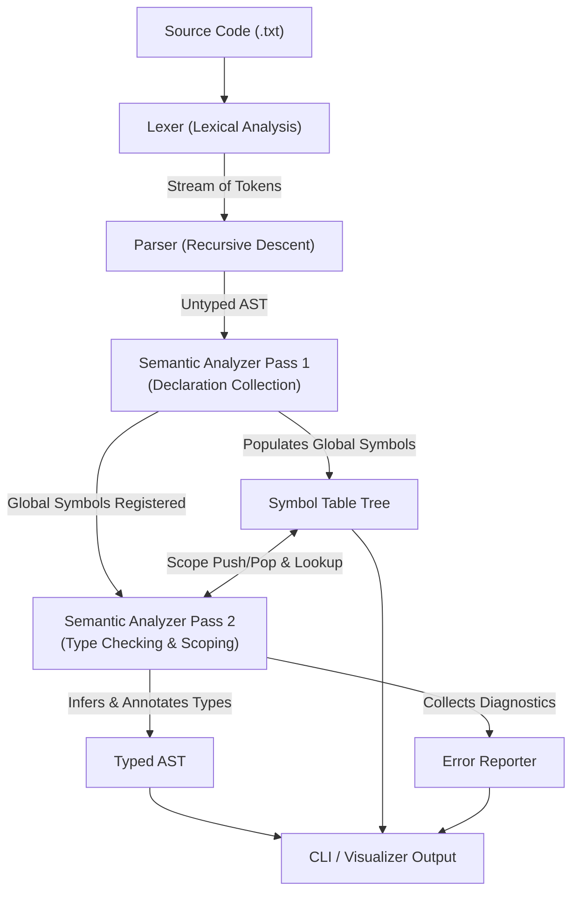
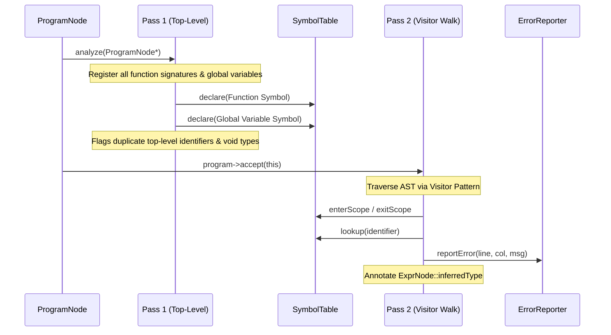
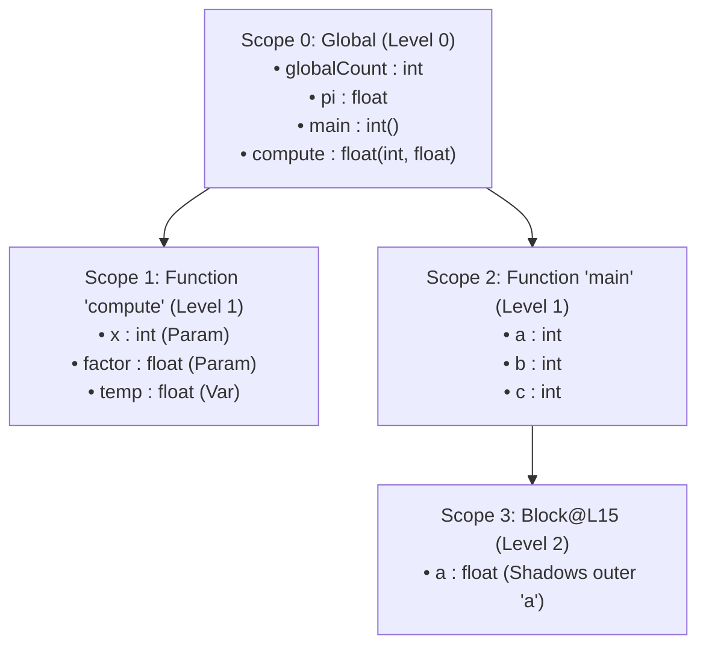

# Architecture & Design of the Semantic Analyzer

This document describes the internal design, component hierarchy, algorithms, and data structures implemented in the Semantic Analyzer.

---

## 1. System Pipeline Overview

The front-end pipeline transforms raw source text into a fully validated and type-annotated Abstract Syntax Tree (AST), paired with a hierarchical symbol table and compiler diagnostics.

---

## 2. Core Components

### 2.1 Lexer (`src/Lexer.hpp`, `src/Lexer.cpp`)
- **Role:** Converts input character stream into a flat sequence of discrete `Token` objects (`src/Token.hpp`).
- **Features:**
  - Tracks 1-indexed line and column coordinates for every token to support precise error diagnostics.
  - Skips whitespace and single-line comments (`// ...`).
  - Distinguishes numeric literals (integers vs floating-point decimals with dot `.` notation).
  - Handles escape characters in character literals (`'\n'`, `'\t'`, `'\0'`, `'\\'`).
  - Maps keyword identifiers (`int`, `float`, `bool`, `char`, `void`, `if`, `else`, `while`, `return`, `true`, `false`) using a lookup map.

### 2.2 Parser & AST (`src/Parser.hpp`, `src/AST.hpp`)
- **Role:** Performs syntactic analysis using deterministic recursive descent.
- **AST Node Hierarchy:**
  - `ASTNode`: Abstract base class with `accept(ASTVisitor*)` and `print(std::ostream&, int indent)`.
  - `ExprNode`: Base expression class carrying an `inferredType` field (`TypePtr`), initialized to `nullptr` and populated during semantic analysis.
    - `LiteralExprNode`: Represents constant values (`int`, `float`, `char`, `bool`).
    - `VariableExprNode`: Identifier reference.
    - `ArrayAccessExprNode`: Subscript expression `identifier[index]`.
    - `BinaryExprNode`: Binary operators with operator precedence.
    - `UnaryExprNode`: Unary prefix operators (`+`, `-`, `!`).
    - `CallExprNode`: Function invocation `func(arg1, arg2, ...)`.
  - `StmtNode`: Base statement class.
    - `VarDeclNode`: Variable declaration (optional initializer expression).
    - `BlockNode`: Enclosed sequence of statements `{ ... }`.
    - `AssignStmtNode`: Assignment statement (`target = value` or `target[index] = value`).
    - `IfStmtNode`: Conditional statement with optional `else` branch.
    - `WhileStmtNode`: Iterative loop statement.
    - `ReturnStmtNode`: Return statement (with or without value).
    - `ExprStmtNode`: Standalone expression evaluated for side effects.
  - `FunctionDeclNode`: Function signature (return type, parameters) and function body `BlockNode`.
  - `ProgramNode`: Top-level compilation unit containing global variables and function definitions.

---

## 3. Two-Pass Semantic Analysis

Semantic analysis is performed by `SemanticAnalyzer` (`src/SemanticAnalyzer.hpp`, `src/SemanticAnalyzer.cpp`) using a two-pass strategy:

### Pass 1: Top-Level Declaration Collection
- **Goal:** Enable forward references and mutual recursion across functions without requiring separate forward header declarations.
- Inspects all top-level statements in `ProgramNode`.
- Registers function prototypes (name, parameter types, return type) in the Global Scope (Level 0).
- Registers global variables in the Global Scope.
- Detects and flags:
  - Duplicate global declarations (variables or functions with colliding names).
  - Variables or parameters declared with invalid `void` type.

### Pass 2: Type Checking, Scoping, and AST Annotation
- Executes the full visitor walk on the AST.
- Enters local scopes for function bodies and nested blocks.
- Resolves identifiers and validates scoping/shadowing.
- Performs type verification on every expression and statement.
- In-place decorates every `ExprNode` with its computed `TypePtr` (`inferredType`), producing the **Typed AST**.

---

## 4. Symbol Table Architecture

The `SymbolTable` (`src/SymbolTable.hpp`, `src/SymbolTable.cpp`) maintains lexical scopes organized as a persistent tree structure:

### Key Operations:
- `enterScope(name)`: Creates a new child `Scope` node linked to the current scope via a `parent` pointer, increments the nesting level, and sets `currentScope` to the new child.
- `exitScope()`: Sets `currentScope = currentScope->parent`. The completed scope remains attached to the tree for debugging and visualization dumps.
- `declare(symbol)`: Checks if the symbol name already exists in `currentScope->symbols`.
  - If exists: returns `false` (duplicate declaration in same scope).
  - If not: registers the symbol and returns `true`.
- `lookupCurrentScope(name)`: Searches only `currentScope`.
- `lookup(name)`: Traverses outward from `currentScope` up through parent scopes to the root (`Global`). Implements lexical scoping and shadowing semantics.

---

## 5. Type System & Type Checker

Types are represented by `Type` instances (`src/Type.hpp`, `src/Type.cpp`), managed via shared pointers (`TypePtr`).

### Type Representation
- **Primitive Types:** `int`, `float`, `bool`, `char`, `void`.
- **Derived Array Type:** `T[N]` where `elementType = T` and `arraySize = N`.
- **Derived Function Type:** `ReturnType(ParamType1, ParamType2, ...)`.
- **Sentinel Error Type:** `TYPE_ERROR`.

### Widening / Promotion Rules
The type checker permits safe numeric widening:
$$\text{int} \xrightarrow{\text{widens to}} \text{float}$$

- **Assignment:** Assigning an `int` expression to a `float` variable is valid (`float x = 10;`).
- **Function Call Arguments:** Passing an `int` argument to a `float` parameter is accepted.
- **Binary Expressions:** Operations between `int` and `float` promote the `int` operand to `float`, producing a `float` result.

### Type Error Recovery Sentinel
To avoid cascading/spurious errors when a subexpression contains a type error:
1. When an invalid expression is evaluated (e.g., undeclared identifier or invalid operator operand), an error is reported once via `ErrorReporter`.
2. The expression is assigned `Type::getError()`.
3. Parent expressions encountering `Type::getError()` skip generating duplicate errors and propagate `Type::getError()` upwards.

---

## 6. Error Diagnostics (`src/ErrorReporter.hpp`)

Diagnostics are recorded with:
- **Severity:** `Error` or `Warning`.
- **Source Coordinates:** 1-indexed `line` and `column`.
- **Message:** Human-readable message describing the semantic violation.

The reporter supports ANSI-colored terminal output, aggregated error counts, and returns standard exit codes (`0` for success, `1` on failure) to integrate smoothly with CI/CD and automated test runners.
